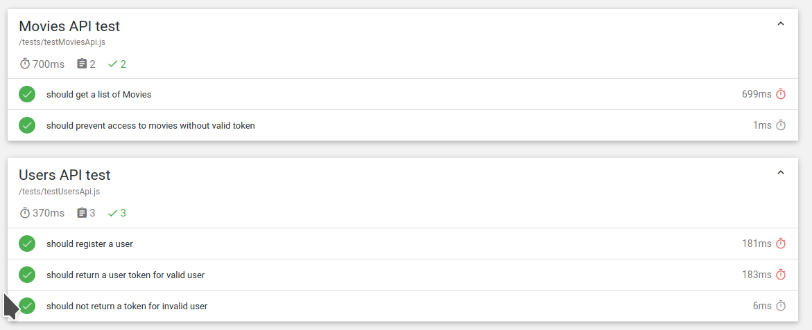

# Assignment 2 - Web API.

Name: Bartosz Osowski

## Overview

Give a brief overview of the Web API functionality.

The Express API allows users with a valid authentication token to access resources such as movies, reviews, movie cast and others relevant to the movie domain. New users can be easily registered if needed, granting access to the API.

## Installation Requirements

#### Packages Used:

Node.js v13.12.0
npm 6.14.4
Mongodb running instance. I have used a free tier one on https://cloud.mongodb.com/

#### Checkout and Run
`git clone https://github.com/bOsowski/ewd-api-labs-2020 && cd ewd-api-labs-2020 && cd expressApp`
`npm install && npm start`

## API Configuration

Create a .env file with the following context: (substitude the mongoDB server for your own)

```
NODE_ENV=development
PORT=8080
HOST=localhost
SWAGGER_DOC=../movie-api-yaml/swagger.yaml
TMDB_KEY=<TMDBKEY>
mongoDB=mongodb+srv://bosowski:<password>@cluster0-q41hh.mongodb.net/test?retryWrites=true&w=majority
seedDb=true
secret=ilikecake
```

## Startup
The following scripts are specified in the package.json:
```
  "scripts": {
      "start": "cross-env NODE_ENV=development nodemon --exec babel-node index.js",
      "unit-test": "cross-env NODE_ENV=test mocha ./api/**/tests/*.js --require babel-core/register --require babel-polyfill --exit",
      "test": "cross-env NODE_ENV=test mocha ./tests/*.js --require babel-core/register --require babel-polyfill --reporter mochawesome"
  }
```
`npm start` will start the API application

`npm run unit-test` will start executing the unit tests

`npm test` will execute integration tests and will also output to expressApp/mochawesome-report/

## API Design

|  |  GET | POST | PUT | DELETE
| -- | -- | -- | -- | -- 
| /api/movies |Get a list of movies | N/A | N/A | N/A
| /api/movies/{movieid} | Get a Movie | N/A | N/A | N/A
| /api/movies/{movieid}/reviews | Get reviews for movie | Create a new review for Movie | N/A | N/A  
| /api/movies/{movieid}/credits | Get credits for movie | N/A | N/A | N/A  
| /api/movies/{movieid}/videos | Get videos for movie | N/A | N/A | N/A  
| /api/users/ | Get users | Register/login in a user | N/A | N/A 
| /api/genres | Get movie genres | N/A | N/A | N/A

[SwaggerHub Doc](https://app.swaggerhub.com/apis/bosowski4/expressAPI/initial)


## Security and Authentication
The API protected endpoints can be accessed by the use of tokens.To receive a token, authenticate a user via a post request to `/api/users?action=authenticate`, specifying the username and password in the body as JSON (eg. `{"username":"user1", "password":"test1"}`).

All routes are protected apart from the `/api/users` route.

## Testing
The API has unit tests which verify that the user validation parts are working correctly and integration tests verifying access and user validation.


## Integrating with React App

[React app repo](https://github.com/bOsowski/MovieApp)

#### Calls to the API from the React app:
~~~Javascript
export const getMovieCredits = id => {
  return fetch(
    `/api/movies/${id}/credits`,
    {headers: {
      'Authorization': window.localStorage.getItem('token')
   }
 }
)
    .then(res => res.json())
};

export const getMovieVideos = id => {
  return fetch(
    `/api/movies/${id}/videos`,
    {headers: {
      'Authorization': window.localStorage.getItem('token')
   }
 }
)
    .then(res => res.json())
};
~~~

## Extra features

Added two extra API enpoints for fetching of related movie videos and cast.

## Independent learning.